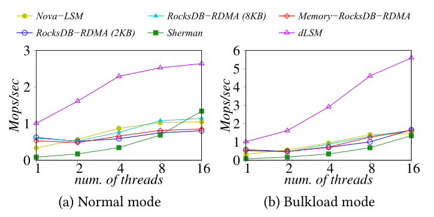
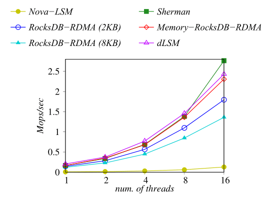
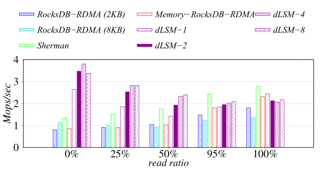
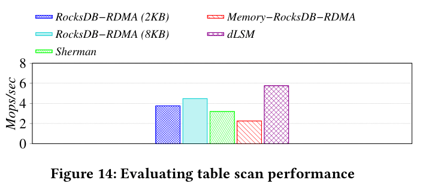
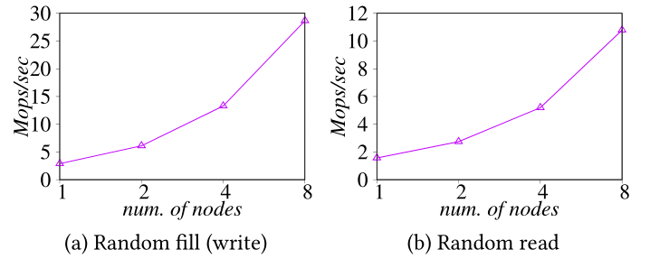

# dLSM: An LSM-Based Index for RDMA-Enabled Memory Disaggregation

dLSM is the first purpose-built LSM-based indexing system for the emerging disaggregated memory DBMSs. dLSM develops a series of optimizations to address the performance challenges. dLSM significantly reduces the software overhead (e.g., the overhead of synchronizing the in-memory write and flushing), to unlock the full potential of the fast RDMA networking. dLSM offloads the LSM-tree compaction to the remote memory node, and addresses a number of follow-up issues (e.g., RPC and garbage collection) to significantly reduce the data movement. dLSM is tuned to deprecate the concept of block structures to leverage the byte-addressability in RDMA-enabled disaggregated memory. Finally, dLSM optimizes the RDMA communication channel including customized RPC, asynchronous RDMA I/O, and optimized thread local queue pairs.

## Highlights 
* 1.8x ∼ 11.7x faster than disaggregated B-tree with pure write workload.
* 1.6x ∼ 3.9x faster than adaptations of existing LSM-tree indexes (e.g. RocksDB) over disaggregated memory with pure write workload.
* Comparable performance to disaggregated B-tree in pure read and read intensive workloads.

## Usage
* Keys and values are arbitrary byte arrays.
* Data is stored sorted by key.
* The basic operations are `Put(key,value)`, `Get(key)`, `Delete(key)`.
* Users can create a transient snapshot to get a consistent view of data.
* Forward iteration (range query) is supported over the data.

## Getting the Source
```bash
git clone --recurse-submodules https://github.com/anonymousMilk/dLSM
```

## Building
This project supports CMake out of the box.

### Build for POSIX
```bash
mkdir -p build && cd build
cmake -DWITH_GFLAGS=1 -DCMAKE_BUILD_TYPE=Release .. && make Server db_bench dLSM
```

### How to run
First, you should config the connection.conf under the main directory. The first line of that file represents the compute nodes' IP addresses, and the second line represents the memory nodes' IP addresses.
* Memory node side: 
```bash
./Server TCPIPPORT MEMORYSIZE NODEID 
```
* Compute node side: 
To run the benchmark:
```bash
./db_bench --benchmarks=fillrandom,readrandom,readrandom,readrandomwriterandom --threads=1 --value_size=400 --num=100000000 --bloom_bits=10 --readwritepercent=5 --compute_node_id=0 --fixed_compute_shards_num=0
```
To utilize dLSM in your code, you need refer to public interface in **include/dLSM/\*.h** .
```bash
YourCodeOverdLSM
```

## Performance

Here is a performance report from the run of the
"fillrandom", "readrandom", "readrandomwriterandom"(mixed) and "readseq" included in the RocksDB's "db_bench", which is under the benchmarks folder.  

### Setup

We test a database with a 100 million entries.  Each entry has a 20 byte 
key, and a 400 byte value.  We conduct the experiments mostly on a platform consisting of two servers: The compute node has a Xeon Platinum 8168 CPU (24 cores, 2.7GHz)  and the memory node has 3TB of DRAM, connected by an RDMA-enabled Mellanox EDR Connectx-4 NIC with a bandwidth of 100Gb/s. Each node runs Ubuntu 18.04.5. For the scalability experiments that require multiple compute nodes and multiple memory nodes, we use CloudLab.

### Baseline

* **RocksDB-RDMA (8KB)**：We implement a baseline solutions that directly port RocksDB to the RDMA-extended remote memory. The block size is set as 8KB by default.
* **RocksDB-RDMA (2KB)**: To better leverage the byte-addressability of the remote memory, we configure the block size as 2KB to illustrate the impact of block size.
* **Memory-RocksDB-RDMA**: We further shrink the block size to the size of a key-value pair, making the SSTable byte-addressable.
* **Nova-LSM**: Nova-LSM is an optimized LSM-tree for storage disaggregation (instead ofmemory disaggregation).  We make it running on tmpfs to make the comparison fair.
* **Sherman**: Sherman is a highly optimized B-tree for the memory disaggregated architecture. We use the source code available in [Sherman: A Write-Optimized Distributed B+Tree Index on Disaggregated Memory ](https://github.com/thustorage/Sherman) (SIGMOD 22).


### Parameter Configurations
We set the same parameters of dLSM and other baseline solutions. The SSTable file size is set to 64MB and the bloom filters key size is set to 10 bits.
For in-memory buffers, the MemTable size is set to 64MB. We set 12 and 4 background threads for compaction and flushing, respectively. 
The number of immutable tables is set to 16 to fully utilize the background flushing threads. To accelerate  compaction further, subcompaction is enabled with 12 workers. These parameters are largely consistent with RocksDB's settings. Unless otherwise stated, dLSM is configured to have 1 shard. 
For Nova-LSM, the subrange is set to 64 to maximize concurrency in background compaction. For Sherman, we follow the default block size (1KB) in the source code. To minimize the RDMA remote accesses, we follow to cache all the internal nodes of the B-tree in local memory.

### Write Performance

The "fillrandom" benchmarks create a brand new database, in a random order.  

The throughput of the system is shown as below.

Normal:

    | Thread number | 1            | 2            | 4            | 8            | 16           |
    | Throughput    | 1.01Mops/sec | 1.61Mops/sec | 2.29Mops/sec | 2.52Mops/sec | 2.64Mops/sec |

<!-- | :------------ | :------------ | :------------ | :------------ | :------------ | :------------ | -->
Bulkload:

    | Thread number | 1            | 2            | 4            | 8            | 16           |
    | Throughput    | 1.01Mops/sec | 1.61Mops/sec | 2.91Mops/sec | 4.60Mops/sec | 5.59Mops/sec |

<!-- | :------------ | :------------ | :------------ | :------------ | :------------ | :------------ | -->


* Compared to baselines

<!--  -->



### Read Performance

The "readrandom" benchmarks run 100 million random key-value queries and report the throughput as below.

    | Thread number | 1            | 2            | 4            | 8            | 16           |
    | Throughput    | 0.20Mops/sec | 0.37Mops/sec | 0.77Mops/sec | 1.46Mops/sec | 2.43Mops/sec |
    
<!-- | :------------ | :------------ | :------------ | :------------ | :------------ | :------------ | -->


* Compared to baselines:
    
<!--  -->


### Mixed Performance
The "readrandomwriterandom" benchmarks run 100 million random key-value queries with 16 threads. We change the read ratio to see the impact of mixed workload.
1 Shard:

    | read ratio | 0%           | 25%          | 50%          | 95%          | 100%         |
    | Throughput | 2.64Mops/sec | 1.86Mops/sec | 1.43Mops/sec | 1.84Mops/sec | 2.43Mops/sec |
    
<!-- | :------------ | :------------ | :------------ | :------------ | :------------ | :------------ | -->

2 Shard:

    | read ratio | 0%           | 25%          | 50%          | 95%          | 100%         |
    | Throughput | 3.47Mops/sec | 2.53Mops/sec | 1.93Mops/sec | 1.95Mops/sec | 2.12Mops/sec |
    
<!-- | :------------ | :------------ | :------------ | :------------ | :------------ | :------------ | -->

4 Shard:

    | read ratio | 0%           | 25%          | 50%          | 95%          | 100%         |
    | Throughput | 3.80Mops/sec | 2.81Mops/sec | 2.32Mops/sec | 2.01Mops/sec | 2.07Mops/sec |
    
<!-- | :------------ | :------------ | :------------ | :------------ | :------------ | :------------ | -->

8 Shard:

    | read ratio | 0%           | 25%          | 50%          | 95%          | 100%         |
    | Throughput | 3/37Mops/sec | 2.82Mops/sec | 2.39Mops/sec | 2.09Mops/sec | 2.18Mops/sec |
    
<!-- | :------------ | :------------ | :------------ | :------------ | :------------ | :------------ | -->

* Compared to baselines:
    
<!--  -->


### Table Scan Performance

The "readseq" benchmarks scan the whole data range by a single thread and report the throughput as below.

dLSM: 7.24Mops/sec

* Compared to baselines:
    
<!--  -->


### Multi-nodes scalability

We run the benchmarks of "randomfill" and "randomread" in RocksDB, with minor modifications to support the multi-node setup. We vary the number of compute nodes and memory nodes from 1 to 8 and each compute node executes 100 millions of operations. The LSM tree is configured with 8 shards per compute node.

"randomfill":

    | Thread number | 1            | 2            | 4            | 8            |
    | Throughput    | 2.88Mops/sec | 6.10Mops/sec | 13.3Mops/sec | 28.7Mops/sec |

<!-- | :------------ | :------------ | :------------ | :------------ | :------------ |-->

"randomread":

    | Thread number | 1            | 2            | 4            | 8            |
    | Throughput    | 1.56Mops/sec | 2.74Mops/sec | 5.19Mops/sec | 10.8Mops/sec |

<!-- | :------------ | :------------ | :------------ | :------------ | :------------ | -->
    
<!--  -->


## Repository contents

Guide to folders:
* **benchmarks**: The file for benchmarking tools.
* **db**: The main implementation for DB functions.
* **include**: The folder for the header files targeting to the users.
* **memory_node**: The implementation for memory nodes.
* **port**: The files defining macro for turning on and off optimizations.
* **script**: The bash scripts for mulitple node setup.
* **table**: Different SSTable implementations.
* **util**: Some low level implementations such as RDMA in dLSM.

Guide to header files:

* **include/dLSM/db.h**: Main interface to the DB: Start here.

* **include/dLSM/comparator.h**: Abstraction for user-specified comparison function.
  If you want just bytewise comparison of keys, you can use the default
  comparator, but clients can write their own comparator implementations if they
  want custom ordering (e.g. to handle different character encodings, etc.).

* **include/dLSM/iterator.h**: Interface for iterating over data. You can get
  an iterator from a DB object.


* **include/dLSM/slice.h**: A simple module for maintaining a pointer and a
  length into some other byte array.

* **include/dLSM/status.h**: Status is returned from many of the public interfaces
  and is used to report success and various kinds of errors.


* **include/dLSM/table.h, include/dLSM/table_builder.h**: Lower-level modules that most
  clients probably won't use directly.
